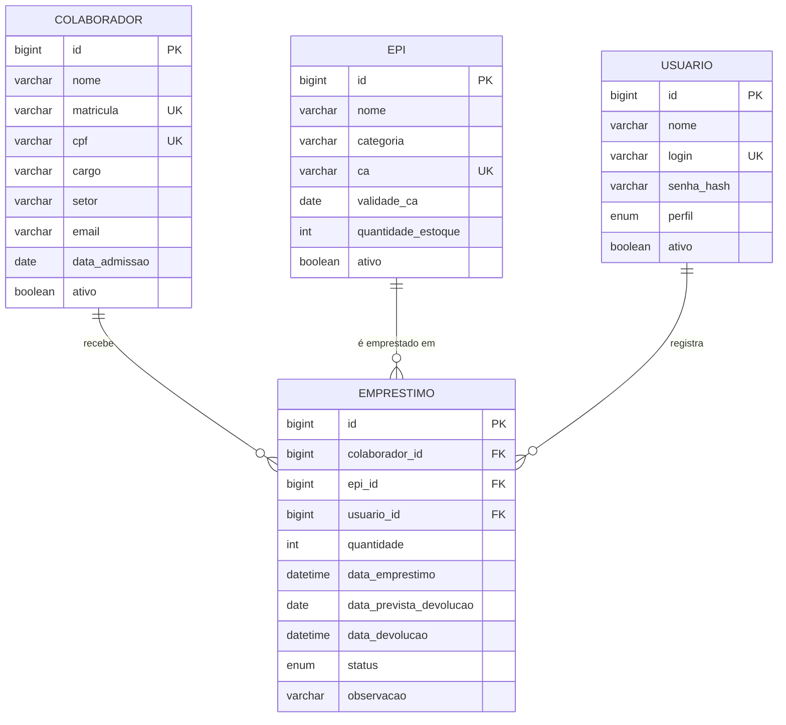
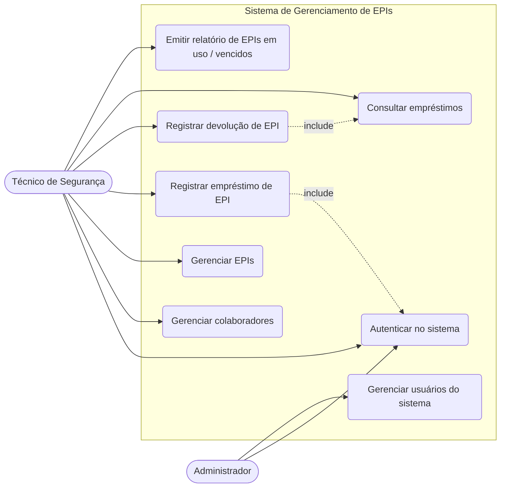

# Documentação técnica — Sistema de Gerenciamento de EPIs

## 1. Visão geral

Sistema para controlar o empréstimo de Equipamentos de Proteção Individual (EPIs) aos colaboradores de uma indústria têxtil, permitindo cadastrar equipamentos, colaboradores e usuários do sistema, e registrar empréstimos e devoluções. Objetivo: garantir o uso dos EPIs e dar suporte ao cumprimento da NR-6.

## 2. Modelagem do banco de dados (DER)

> Os diagramas abaixo usam Mermaid (renderizam direto no GitHub). Para entregar como imagem, cole o código em https://mermaid.live e exporte em PNG, ou reproduza no BRModelo / MySQL Workbench / Draw.io usando o `schema.sql`.



Script SQL completo: [`schema.sql`](schema.sql).

**Cardinalidades:** um colaborador pode ter vários empréstimos; um EPI pode aparecer em vários empréstimos; um usuário do sistema registra vários empréstimos. Cada empréstimo pertence a exatamente um colaborador, um EPI e um usuário.

## 3. Diagrama de casos de uso

Atores: **Técnico de Segurança do Trabalho** (opera o sistema) e **Administrador** (gerencia usuários).



> Para entregar no formato UML tradicional (elipses e boneco), redesenhe no Draw.io ou StarUML com estes mesmos atores e casos de uso.

## 4. Requisitos

### 4.1 Requisitos funcionais

| ID | Requisito |
|----|-----------|
| RF01 | O sistema deve permitir cadastrar, listar, editar e excluir colaboradores. |
| RF02 | O sistema deve permitir cadastrar, listar, editar e excluir EPIs (nome, categoria, CA, validade do CA e estoque). |
| RF03 | O sistema deve permitir cadastrar e gerenciar usuários do sistema, com perfis de acesso. |
| RF04 | O sistema deve registrar o empréstimo de um EPI a um colaborador, informando quantidade e data prevista de devolução. |
| RF05 | O sistema deve registrar a devolução do EPI e atualizar o estoque automaticamente. |
| RF06 | O sistema deve pesquisar colaboradores por nome. |
| RF07 | O sistema deve exibir mensagens de sucesso ou falha após cada operação de cadastro, edição e exclusão. |
| RF08 | O sistema deve pedir confirmação antes de excluir um registro. |
| RF09 | O sistema deve alertar sobre EPIs com CA vencido ou empréstimos com devolução atrasada. |

### 4.2 Requisitos não funcionais

| ID | Requisito |
|----|-----------|
| RNF01 | **Usabilidade:** interface intuitiva e responsiva, com feedback visual claro (Bootstrap). |
| RNF02 | **Persistência:** todos os dados devem ser armazenados em banco de dados relacional (MySQL). |
| RNF03 | **Segurança:** acesso mediante login; senhas armazenadas com hash (BCrypt), nunca em texto puro. |
| RNF04 | **Desempenho:** listagens e pesquisas devem responder em até 2 segundos para até 10.000 registros. |
| RNF05 | **Portabilidade:** o sistema deve rodar em qualquer SO com Java 17+, e ter opção de execução via Docker. |
| RNF06 | **Manutenibilidade:** código organizado em camadas (model, repository, controller, view) e versionado no Git. |
| RNF07 | **Integridade:** matrícula e CPF devem ser únicos; dados obrigatórios validados no servidor. |

## 5. Wireframes

### 5.1 Cadastro de colaborador

```
+--------------------------------------------------------------+
| Gestão de EPIs                  [Colaboradores] [Novo colab.] |
+--------------------------------------------------------------+
| Cadastrar colaborador                                        |
| +----------------------------------------------------------+ |
| | (!) Colaborador cadastrado com sucesso!              [x] | |
| +----------------------------------------------------------+ |
| Nome *                                  Matrícula *          |
| [______________________________]        [______________]     |
| CPF *             Cargo *               Setor *              |
| [____________]    [____________]        [____________]       |
| E-mail                                  Data de admissão     |
| [______________________________]        [dd/mm/aaaa]         |
| [x] Colaborador ativo                                        |
|                                                              |
| [ Cadastrar ]   [ Voltar à lista ]                           |
+--------------------------------------------------------------+
```

### 5.2 Listagem com pesquisa

```
+--------------------------------------------------------------+
| Gestão de EPIs                  [Colaboradores] [Novo colab.] |
+--------------------------------------------------------------+
| Colaboradores                                                |
| [ Pesquisar por nome____________ ] [Pesquisar] [Limpar]      |
| +----------------------------------------------------------+ |
| | Nome      | Matrícula | CPF | Cargo | Setor | Sit. | Ações| |
| |-----------|-----------|-----|-------|-------|------|------| |
| | Ana Lima  | 1001      | ... | Costu | Corte | Ativo| [Editar][Excluir]|
| | João Reis | 1002      | ... | Op.   | Tece. | Ativo| [Editar][Excluir]|
| +----------------------------------------------------------+ |
+--------------------------------------------------------------+
```

### 5.3 Modal de confirmação de exclusão

```
        +----------------------------------------+
        | Confirmar exclusão                  [x]|
        |----------------------------------------|
        | Deseja realmente excluir o colaborador |
        | **Ana Lima**? Esta ação não pode ser   |
        | desfeita.                              |
        |----------------------------------------|
        |               [Cancelar]   [Excluir]   |
        +----------------------------------------+
```

### 5.4 Edição

Mesma tela do cadastro (5.1), com os campos já preenchidos e botão **Salvar alterações**.

### 5.5 Demais telas (próximas entregas)

- **EPIs:** mesma estrutura de lista + formulário (nome, categoria, CA, validade, estoque).
- **Usuários:** lista + formulário (nome, login, senha, perfil).
- **Empréstimo:** selecionar colaborador, selecionar EPI, quantidade, data prevista; lista de empréstimos em aberto com botão **Registrar devolução**.

> Se o professor exigir Figma, reproduza estes layouts no Figma usando os wireframes acima como base.

## 6. Tecnologias

Java 17, Spring Boot 3 (Web, Data JPA, Validation, Thymeleaf), MySQL 8, Bootstrap 5, Maven, Docker.
